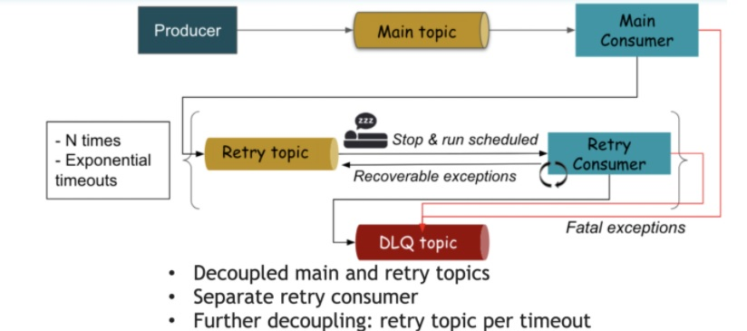

# Kafka Java
### Project contains examples working with Apache Kafka for java developers

------------------------
#### Arhitecture

--------------

## Install

1. download project

2. install kafka and run;
   go to directory(open in powerShell) [link to folder](Compose)
   docker-compose -f docker-compose.yml up
   (Ctrl+C to exit)or
   docker-compose -f docker-compose.yml up -d
   to stop
   docker-compose down
   to enter into kafka
   docker exec -it kafka /bin/sh
### CLI
   cd /opt/
   
   cd bitnami
   
   cd kafka  -> here create topic
   
   cd bin/
   
   cd . .
### -> create topic:
   if installed not as docker commands: 
   kafka-topics  --zookeeper zookeeper:2181 --topic first --create  --partitions 1 --replication-factor 1; 
   
   kafka-topics  --zookeeper zookeeper:2181 --list
   
   kafka-topics  --zookeeper zookeeper:2181 --topic first --describe;
   
   kafka-topics  --zookeeper zookeeper:2181 --topic first --delete
  
  ##### In Docker:
   ./bin/kafka-topics.sh --create --zookeeper zookeeper:2181 --replication-factor 1 --partitions 1 --topic first
   
   ./bin/kafka-topics.sh --list --zookeeper zookeeper:2181
   
   ./bin/kafka-topics.sh  --describe --zookeeper zookeeper:2181 --topic first
   
   ./bin/kafka-topics.sh  --delete --zookeeper zookeeper:2181 --topic first 
   
####   ->Producer
   commands:
   
   kafka-console-producer --broker-list 127.0.0.1:9092 --topic first
   write messages then (Ctrl+C to exit)
   
   kafka-console-producer --broker-list 127.0.0.1:9092 --topic first --producer-property acks=all
   write messages then (Ctrl+C to exit)
   
   kafka-console-producer --broker-list 127.0.0.1:9092 --topic createdproducer
      write messages then (Ctrl+C to exit) --> it will be WARN and create topic with one(higest in config) partition and one replication factor
  
  ##### In Docker:
   ./bin/kafka-console-producer.sh --broker-list 127.0.0.1:9092 --topic first
   write messages then (Ctrl+C to exit)
   
   ./bin/kafka-console-producer.sh --broker-list 127.0.0.1:9092 --topic first --producer-property acks=all
   write messages then (Ctrl+C to exit)
   
   ./bin/kafka-console-producer.sh --broker-list 127.0.0.1:9092 --topic createdproducer
   write messages then (Ctrl+C to exit) --> it will be WARN and create topic with one(higest in config) partition and one replication factor
   
   nano config/server.properties  in ###Log Basics###-> num.partitions=
   
 #### ->Consumer
   commands:
   kafka-console-consumer --bootstrap-server 127.0.0.1:9092 --topic first
   start recieve messages only new (Ctrl+C to exit)
   
   kafka-console-consumer --bootstrap-server 127.0.0.1:9092 --topic first --from-beginning
   start recieve messages all (Ctrl+C to exit)
   
   kafka-console-consumer --bootstrap-server 127.0.0.1:9092 --topic first --group myapp
   start recieve messages only new (Ctrl+C to exit)
   
   kafka-console-consumer --bootstrap-server 127.0.0.1:9092 --topic first --group myapp --from-beginning
   start recieve all messages  (Ctrl+C to exit)
   
  ##### In Docker:
  
   ./bin/kafka-console-consumer.sh--bootstrap-server 127.0.0.1:9092 --topic first
   start recieve messages only new (Ctrl+C to exit)
   
   ./bin/kafka-console-consumer.sh--bootstrap-server 127.0.0.1:9092 --topic first --from-beginning
   start recieve messages all (Ctrl+C to exit)
   
   ./bin/kafka-console-consumer.sh--bootstrap-server 127.0.0.1:9092 --topic first --group myapp
   start recieve messages new(Ctrl+C to exit)
   
   ./bin/kafka-console-consumer.sh--bootstrap-server 127.0.0.1:9092 --topic first --group myapp --from-beginning
   start recieve all messages (Ctrl+C to exit)
   
   
   !!!!if we open 3 teminals with( kafka-console-consumer --bootstrap-server 127.0.0.1:9092 --topic first --group myapp)
   and we have 3 partition  each consumer recieve messages by query 1-1,2-2,3-3 => then we glose one terminal (3) first recieve 1,2 and sec 3,
   => then we close (2) -> all mesages recieve first consumer
   !!!!if we close consumer group and then after time run again we recieve all missed messages!!!!
   
 ####  ->Consumer groups
   commands:
   kafka-consumer-groups --bootstrap-server localhost:9092 --list
   
   kafka-consumer-groups --bootstrap-server localhost:9092 --describe --group myapp
   
   kafka-consumer-groups --bootstrap-server localhost:9092 --group myapp --reset-offsets --to-earliest --execute --topic first
   
   kafka-consumer-groups --bootstrap-server localhost:9092 --group myapp  --reset-offsets --shift-by -2 --execute --topic first
   
  ##### In Docker:
   ./bin/kafka-consumer-groups.sh--bootstrap-server localhost:9092 --list
   
   ./bin/kafka-consumer-groups.sh --bootstrap-server localhost:9092 --describe --group myapp
   
   ./bin/kafka-consumer-groups.sh --bootstrap-server localhost:9092 --group myapp --reset-offsets --to-earliest --execute --topic first
   
   ./bin/kafka-consumer-groups.sh --bootstrap-server localhost:9092 --group myapp --reset-offsets --shift-by -2 --execute --topic first
   
   
  ## App java Kafka examples vsvdev.first [link to folder](kafka_examples/src/main/java/vsvdev/first)
  
   ##### create topic firstexample
   
   ./bin/kafka-topics.sh --create --zookeeper zookeeper:2181 --replication-factor 1 --partitions 3--topic firstexample
   
 ##### run consumer
  
   ./bin/kafka-console-consumer.sh--bootstrap-server 127.0.0.1:9092 --topic firstexample --group firstapp
   
   then run ProducerDemo
   
   then run ProducerDemoWithCallback
   
   then run ProducerDemoKeys
   
   then run ConsumerDemo
  
   run 2 times ConsumerDemoGroups then run ProducerDemo
 
   run ConsumerDemoWithThread
  
   run ConsumerDemoAssignSeek
   
   
  ## TWITTER project twitterexamples  [link to folder](kafka_examples/src/main/java/twitterexamples)
   create account -> go to https://developer.twitter.com/
   
   create app(Twitter) and copy credentials to TwitterProducer
   
   Credentials:
   API key
  
   API secret key
   
   Access token:
  
   Access token secret:
   
   Intended use:
  
     
   docker exec -it kafka /bin/sh
   
   create topic in kafka
   
   ./bin/kafka-topics.sh --create --zookeeper zookeeper:2181 --replication-factor 1 --partitions 6--topic twitter
   
   run consumer
   
   ./bin/kafka-console-consumer.sh--bootstrap-server 127.0.0.1:9092 --topic twitter
   
   run TwitterProducer go to twitter and create post which contains "terms"
   
  
 ##  ElasticSearch  [link to folder](consumer-elasticsearch)
  
   https://app.bonsai.io/signup   *** free 3 node
   
   create account
   
   name app: 
   #### You can use docker compose or just install
   
   #### Docker
   
 ##### 1 node use compose [link to folder](consumer-elasticsearch/elasticsearch_docker)
 ##### 1 node use comand:  
   docker pull docker.elastic.co/elasticsearch/elasticsearch:7.12.0
   
   docker run -p 9200:9200 -p 9300:9300 -e "discovery.type=single-node" docker.elastic.co/elasticsearch/elasticsearch:7.12.0
 ##### 3 node use compose   [link to folder](consumer-elasticsearch/elastic_3_node)
  #### go to console   -> PUT /twitter -> Run
  
   to check -> GET /_cat/indices
  
  #### -> PUT /twitter/tweets/1
   with: {"course": "Kafka",
   "teacher":"VSVDev",
   "module" : "ElasticSearch"}->Run
  
   check GET /twitter/tweets/1
  
  #### to delete:
  
   delete: DELETE /twitter/tweets/1->Run
   delete: DELETE /twitter->Run
  
  #### paste in ElasticSearchConsumer your credentials from bonsai
  
  "username:password@host"(without port)
  
   run TwitterProducer -> stop
   
   run  ElasticSearchConsumer -> stop(when recieved 0 records)
   
  ## Streams  [link to folder](kafka_streams_filter)
  
  #### create topic in kafka
  
   ./bin/kafka-topics.sh --create --zookeeper zookeeper:2181 --replication-factor 1 --partitions 6--topic important_tweets
   
   run run TwitterProducer -> stop
   
   run StreamsFilterTweets-> stop
  
   run ConsumerDemoWithThreadAfterStreamFilter-> stop
   
   ##  Spring publisher [link to folder](kafka_publisher_spring)  & consumer [link to folder](spring_consumer)
  
  #### create topic in kafka
  
   ./bin/kafka-topics.sh --create --zookeeper zookeeper:2181 --replication-factor 1 --partitions 3--topic vsvdev
  
   run KafkaPublisherSpringApplication 
   
  ##### send messages
   
   http://localhost:8081/publish/{name}(enter name)
   http://localhost:8081/publishJson
   
   run  SpringConsumerApplication
   
  ##### consume messages
   
   http://localhost:8080/consumeStringMessage
   http://localhost:8080/consumeJsonMessage
  

## Consuming strategy  [link to folder](kafka_consuming)

run as show above docker compose [link to folder](Compose) then run app

`./bin/kafka-console-producer.sh --broker-list localhost:9092 --topic test --property "parse.key=true" --property "key.separator=:"` - producer

`asd:{ "idempotencyKey": "3cc52d97-c0e3-4b84-b220-dbf4ac352dbc", "amount": 101.12, "initiatedOn": "2021-05-23 23:59:35" }`

`asd:{ "idempotencyKey": "3cc52d97-c0e3-4b84-b220-dbf4ac352dbc", "amount": -101.12, "initiatedOn": "2021-05-23 23:59:35" }`

`asd:{ "idempotencyKey": "3cc52d97-c0e3-4b84-b220-dbf4ac352dbc", "amount": 1000001.12, "initiatedOn": "2021-05-23 23:59:35" }`
